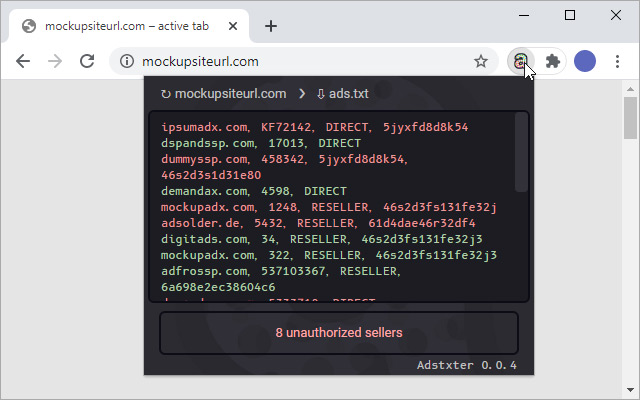
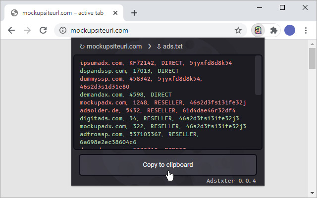

# Adstxter

A simple chrome extension for checking ads.txt files. Provides a one-click test for the presence of given sellers. Active only when started by user. Otherwise, suspended and not draining any resources. Handling of ads.txt follows the final [IAB Tech Lab ads.txt Specification Version 1.0.2](https://iabtechlab.com/wp-content/uploads/2019/03/IAB-OpenRTB-Ads.txt-Public-Spec-1.0.2.pdf). 

Install it from the [Chrome Webstore](https://chrome.google.com/webstore/detail/ncdnbcbfjcflaocmpnhjajngpdoipnci).

## Usage
 - To check your sellers’ authorization, enter them in the input field of the extension popup. One entry per line. Entered sellers are saved across browser sessions until replaced or removed.
 - The test targets the currently loaded site.

## Limitations
 * Checking ads.txt files on subdomains is not implemented for now.
 * Due to JavaScript security limitations, it's not possible to control the number of redirects when fetching ads.txt. As a result, the following ads.txt requirement isn't honored:

    > Only a single HTTP redirect to a destination outside the original root domain is allowed to facilitate one-hop delegation of authority to a third party's web server domain. If the third party location returns a redirect, then the advertising system should treat the response as an error.
    > - *IAB Tech Lab ads.txt Specification Version 1.0.2*
